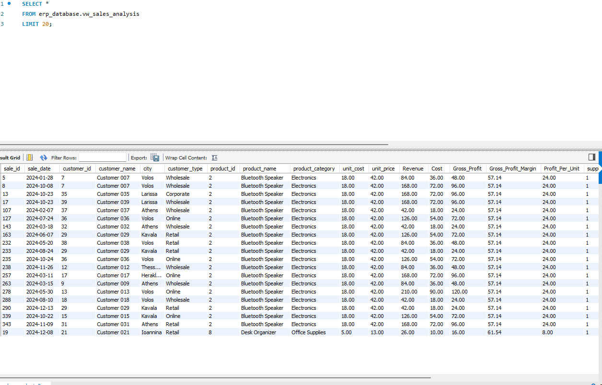
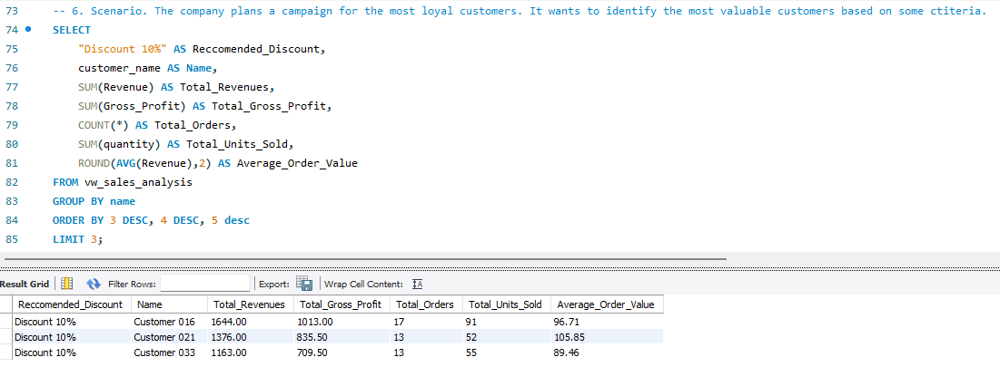
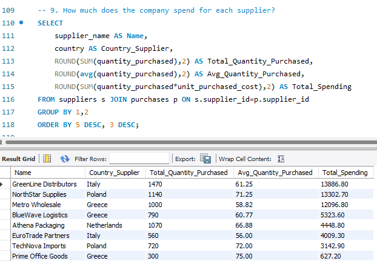
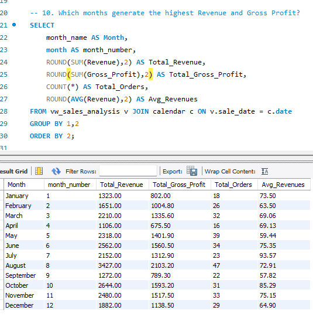
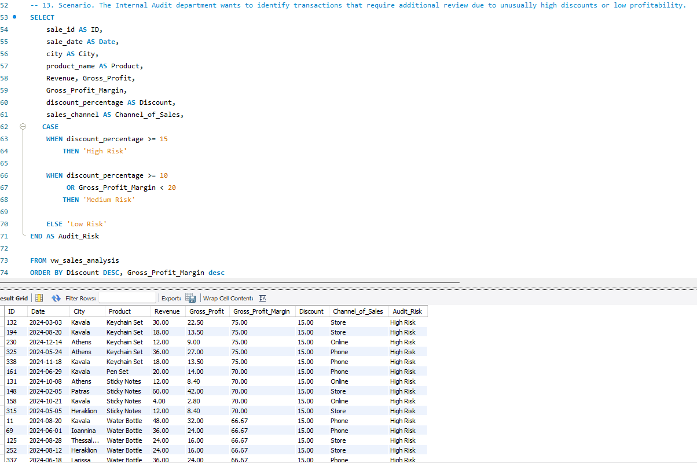

# Small Business ERP Analytics | SQL Project

## Project Overview

This project simulates the operational environment of a small commercial business using a synthetic ERP-style dataset.

The project covers the complete SQL workflow, including:

- Relational database design
- Creation of primary and foreign keys
- Data import from Excel and CSV files
- Development of an analytical SQL view
- Calculation of business KPIs
- Business-oriented SQL queries
- Management and internal audit scenarios

The main objective is to transform operational data related to sales, customers, products, suppliers, purchases, payments and expenses into useful information for management decision-making.

> **Important Note:** All data included in this project is fictional and was generated for educational and portfolio purposes. It does not represent a real company, real customers or real financial records.

---

## Business Context

The fictional company stores its operational data in separate ERP-style tables.

Management wants to use this information to answer questions related to:

- Sales and profitability
- Customer value
- Product performance
- Geographic performance
- Sales channel effectiveness
- Procurement activity
- Supplier spending
- Customer payments
- Estimated outstanding balances
- Monthly performance
- Customer segmentation
- Internal audit risk monitoring

---

## Technologies Used

- MySQL
- MySQL Workbench
- SQL
- Microsoft Excel
- CSV
- GitHub

---

## Dataset Overview

The original dataset was created in Microsoft Excel, with each worksheet representing a separate source table.

The dataset contains:

| Dataset Component | Records |
|---|---:|
| Customers | 40 |
| Suppliers | 8 |
| Products | 20 |
| Sales Transactions | 350 |
| Purchase Transactions | 110 |
| Payment Records | 230 |
| Expense Records | 84 |
| Calendar Dates | 366 |

The analysis covers the 2024 calendar year.

---

## Database Tables

The relational database contains eight tables:

| Table | Description |
|---|---|
| `customers` | Customer details, location and customer type |
| `suppliers` | Supplier details, country and payment terms |
| `products` | Product information, category, cost, price and supplier |
| `sales` | Individual sales transactions |
| `purchases` | Product purchases from suppliers |
| `payments` | Customer payment records |
| `expenses` | Operating expense records |
| `calendar` | Calendar dimension used for time-based analysis |

---

## Database Relationships

Primary and foreign keys were implemented to preserve referential integrity.

The main relationships are:

- `products.supplier_id` → `suppliers.supplier_id`
- `sales.customer_id` → `customers.customer_id`
- `sales.product_id` → `products.product_id`
- `sales.sale_date` → `calendar.date`
- `purchases.supplier_id` → `suppliers.supplier_id`
- `purchases.product_id` → `products.product_id`
- `purchases.purchase_date` → `calendar.date`
- `payments.customer_id` → `customers.customer_id`
- `payments.payment_date` → `calendar.date`
- `expenses.expense_date` → `calendar.date`


---

## Data Import Process

Each analytical worksheet from the original Excel workbook was exported as a CSV file.

The data was imported into MySQL using `LOAD DATA LOCAL INFILE`.

During the import process:

- Date fields were converted into MySQL-compatible date formats.
- Decimal commas were converted into decimal points.
- CSV delimiters and line terminators were handled explicitly.
- Imported row counts were checked against the original Excel dataset.
- Foreign keys were added after confirming the integrity of the imported data.

The import scripts are available in the `SQL` folder.

---

## Sales Analysis View

A transaction-level analytical view named `vw_sales_analysis` was created by joining:

- `sales`
- `customers`
- `products`
- `suppliers`

Each row in the view represents one sales transaction.

The view includes customer, product and supplier attributes together with calculated business KPIs.

### KPIs Calculated

- Revenue
- Cost
- Gross Profit
- Gross Profit Margin
- Profit per Unit
- Discount Percentage
- Quantity Sold

### KPI Logic

```text
Revenue = Quantity × Unit Price

Cost = Quantity × Unit Cost

Gross Profit = Revenue − Cost

Gross Profit Margin = Gross Profit ÷ Revenue × 100

Profit per Unit = Unit Price − Unit Cost
```

### View Preview



---

# Business Queries

## Query 1 — Product Category Profitability

### Business Question

**Which product category generates the highest gross profit?**

### Business Objective

The objective is to compare product categories based on total gross profit and identify the categories that contribute most strongly to company profitability.

This information can support:

- Product portfolio decisions
- Pricing decisions
- Procurement planning
- Commercial prioritization

### SQL Techniques Used

- `SUM()`
- `GROUP BY`
- `ORDER BY`
- Aggregate functions

---

## Query 2 — Top Customer Analysis

### Business Question

**Who are the company’s top five customers?**

### Business Objective

The analysis identifies the most valuable customers by comparing:

- Total revenue
- Total gross profit
- Number of orders
- Average order value

This information can support customer relationship management and loyalty planning.

### SQL Techniques Used

- `SUM()`
- `COUNT()`
- `AVG()`
- `GROUP BY`
- `ORDER BY`
- `LIMIT`

---

## Query 3 — Geographic Performance Analysis

### Business Question

**Which city generates the highest revenue, and which city generates the highest gross profit?**

### Business Objective

The objective is to identify the strongest geographic markets from both a sales and profitability perspective.

Revenue and gross profit are evaluated separately because the city generating the highest sales does not necessarily generate the highest profit.

### SQL Techniques Used

- `SUM()`
- `GROUP BY`
- `ORDER BY`
- `LIMIT`
- `UNION ALL`

---

## Query 4 — Sales Channel Performance

### Business Question

**Which sales channel performs best in terms of revenue, gross profit and order activity?**

### Business Objective

The analysis compares the available sales channels using:

- Total revenue
- Total gross profit
- Total orders
- Average order value

This helps management understand whether customers prefer channels such as online, store or phone sales and which channel contributes the greatest business value.

### SQL Techniques Used

- `SUM()`
- `COUNT()`
- `AVG()`
- `GROUP BY`
- `ORDER BY`

---

## Query 5 — Top Products by Gross Profit

### Business Question

**Which products generate the highest gross profit for the company?**

### Business Objective

The analysis ranks the top-performing products using profitability and sales activity metrics.

The results help distinguish:

- Products generating high gross profit
- Products with high order frequency
- Products with high sales volume
- Products with strong average order value

### SQL Techniques Used

- `SUM()`
- `COUNT()`
- `AVG()`
- `GROUP BY`
- `ORDER BY`
- `LIMIT`

---

## Query 6 — Customer Loyalty Campaign

### Business Scenario

The company wants to launch a loyalty campaign and reward its three most valuable customers.

The customers are selected primarily based on total revenue, while total gross profit and order frequency are used as additional performance indicators.

The selected customers are recommended to receive a **10% loyalty discount**.

### Metrics Considered

- Total revenue
- Total gross profit
- Total orders
- Total units purchased
- Average order value

### Business Value

This scenario demonstrates how customer transaction data can support a targeted marketing and loyalty decision.



---

## Query 7 — Product Procurement Analysis

### Business Question

**Which products does the company purchase the most?**

### Business Objective

The analysis compares products based on:

- Total units purchased
- Number of purchase transactions
- Average purchased quantity
- Total procurement cost

This can support purchasing and inventory-planning decisions.

### SQL Techniques Used

- `JOIN`
- `SUM()`
- `COUNT()`
- `AVG()`
- `GROUP BY`
- `ORDER BY`

---

## Query 8 — Payment Method Analysis

### Business Question

**Which payment methods are most frequently used by customers?**

### Business Objective

The analysis compares payment methods using:

- Number of payments
- Total amount paid
- Average payment value

A payment method may be used frequently while another may generate a higher average transaction value.

### SQL Techniques Used

- `COUNT()`
- `SUM()`
- `AVG()`
- `GROUP BY`
- `ORDER BY`

---

## Query 9 — Estimated Outstanding Customer Balances

### Business Question

**Which customers have an estimated outstanding balance?**

### Business Objective

The analysis compares each customer’s total sales value with the total payments received from that customer.


### Important Limitation

Payments are not connected to individual sales invoices in the current dataset.

Therefore, the calculated balance is an **analytical estimate** and should not be interpreted as a formal accounts receivable balance.

A real accounting system would require additional fields such as:

- Invoice ID
- Invoice date
- Payment due date
- Payment status
- Payment-to-invoice matching

### SQL Techniques Used

- Subqueries
- `LEFT JOIN`
- `COALESCE()`
- `SUM()`
- Calculated fields
- Filtering estimated balances

---

## Query 10 — Supplier Spending Analysis

### Business Scenario

Management wants to understand how much money the company spends with each supplier.

### Business Question

**Which suppliers account for the highest procurement spending?**

### Metrics Considered

- Total purchased quantity
- Average purchased quantity
- Number of purchase transactions
- Total supplier spending
- Supplier country

### Business Value

The analysis helps management identify:

- Major suppliers
- Procurement concentration
- Suppliers receiving the highest spending
- Potential supplier dependency



---

## Query 11 — Monthly Business Performance

### Business Question

**Which months generate the highest revenue and gross profit?**

### Business Objective

The sales view is joined with the calendar table to evaluate monthly performance.

The analysis includes:

- Total revenue
- Total gross profit
- Total orders
- Total units sold
- Average order value

This information can support:

- Budgeting
- Forecasting
- Sales planning
- Performance monitoring
- Identification of monthly patterns

### SQL Techniques Used

- `JOIN`
- `SUM()`
- `COUNT()`
- `AVG()`
- `GROUP BY`
- Chronological ordering



---

## Query 12 — Customer Type Performance

### Business Question

**Which customer type generates the highest revenue and gross profit?**

### Business Objective

The company serves different customer segments, such as:

- Retail
- Wholesale
- Corporate
- Online

The analysis compares the customer types using:

- Total revenue
- Total gross profit
- Total orders
- Total units sold
- Average order value
- Average gross profit per order

This allows management to understand which customer segment contributes the most business value.

### SQL Techniques Used

- `SUM()`
- `COUNT()`
- `AVG()`
- `GROUP BY`
- `ORDER BY`

---

## Query 13 — Internal Audit Risk Analysis

### Business Scenario

The Internal Audit department wants to identify sales transactions that may require additional review.

Transactions are classified using discount and profitability criteria.

### Risk Classification

```text
High Risk:
Discount ≥ 15% OR Gross Profit Margin < 10%

Medium Risk:
Discount ≥ 10% OR Gross Profit Margin < 20%

Low Risk:
All remaining transactions
```

### Fields Reviewed

- Sale ID
- Sale date
- Customer city
- Product
- Revenue
- Gross profit
- Gross profit margin
- Discount percentage
- Sales channel
- Audit risk category

### Business Value

This scenario demonstrates how transactional analytics can support:

- Internal audit
- Exception reporting
- Discount-policy monitoring
- Profitability control
- Risk-based transaction review

The classification is an analytical screening mechanism and does not prove that a transaction is incorrect or fraudulent.

### SQL Techniques Used

- `CASE`
- Conditional logic
- Calculated KPIs
- Transaction-level analysis
- Risk classification



---
